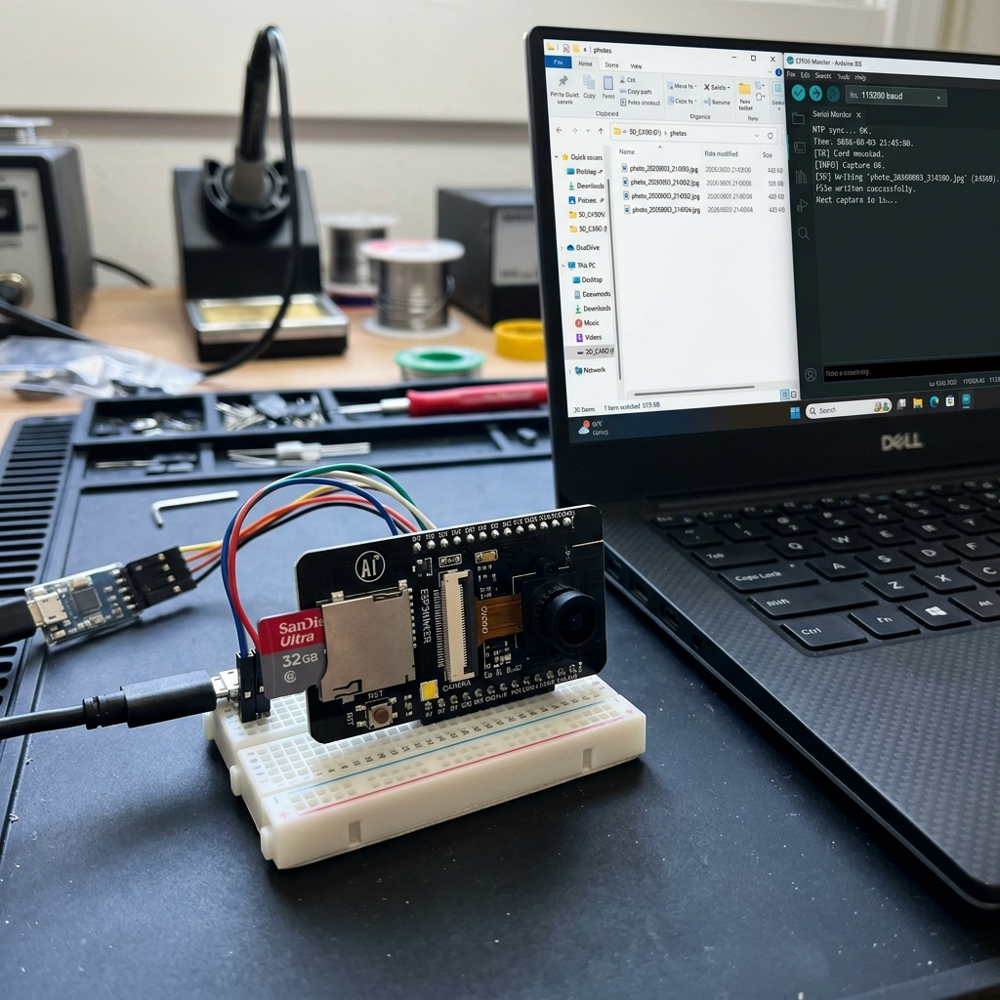

# ESP32-CAM MicroSD NTP Photo Logger ⏱️💾


An off-grid edge photo logging engine for the ESP32-CAM that syncs precision time with NTP pool servers and writes timestamped high-resolution JPEG photos directly to MicroSD card storage.

---

## 📸 Proof of Work & Demonstration



---

## ⚡ Features
- **1-Bit MMC SD Mode:** Uses `SD_MMC.begin("/sdcard", true)` to operate in 1-bit mode, leaving GPIOs free for camera data lines.
- **NTP Time Synchronization:** Automatically synchronizes UTC time from `pool.ntp.org` on boot.
- **Dynamic File Naming:** Formats photos as `/photo_YYYYMMDD_HHMMSS.jpg` for clean indexed log archives.
- **Atomic File Writing:** Safe buffer flush prevents corruption on sudden power loss.

---

## 🔌 Hardware Pinout (MicroSD Card Slot)

Uses onboard MMC slot pins:
- **GPIO 2** (Data 0)
- **GPIO 14** (Clock)
- **GPIO 15** (Command)

---

## 🚀 Quick Start Guide

1. Clone the repository:
   ```bash
   git clone https://github.com/harsh-pandhe/esp32cam-02-sdcard-timestamp.git
   cd esp32cam-02-sdcard-timestamp
   ```
2. Insert a FAT32-formatted MicroSD card into the ESP32-CAM slot.
3. Build & upload via PlatformIO:
   ```bash
   pio run -t upload
   ```
4. Monitor serial logs to confirm time sync and photo creation:
   ```bash
   pio device monitor -b 115200
   ```

---

## 📜 License
MIT License. Created by [Harsh Pandhe](https://github.com/harsh-pandhe).
