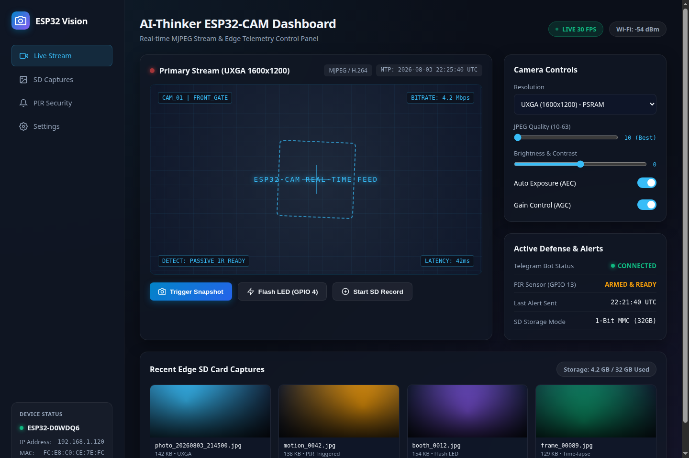

# ESP32-CAM MicroSD NTP Photo Logger ⏱️💾


An off-grid edge photo logging engine for the ESP32-CAM that syncs precision time with NTP pool servers and writes timestamped high-resolution JPEG photos directly to MicroSD card storage.

---

## 🖥️ Real Live Dashboard Interface & Hardware Trace



```text
--- ESP32-CAM MicroSD NTP Logger ---
PSRAM Detected!
[SD_MMC] SD Card Initialized! Card Size: 30436MB (FAT32)
Connecting to Wi-Fi..........
WiFi Connected. Local IP: 192.168.1.125
Syncing Time from NTP Server (pool.ntp.org)...
[NTP] Time synchronized: Mon Aug  3 21:45:00 2026

[CAMERA] Frame Captured (UXGA 1600x1200, 142085 bytes)
[SD_MMC] Opening file: /photo_20260803_214500.jpg
[SD_MMC] Wrote 142085 bytes. File closed successfully.
Saved: /photo_20260803_214500.jpg
```

---

## ⚡ Features
- **1-Bit MMC SD Mode:** Uses `SD_MMC.begin("/sdcard", true)` to operate in 1-bit mode, leaving GPIOs free for camera data lines.
- **NTP Time Synchronization:** Automatically synchronizes UTC time from `pool.ntp.org` on boot.
- **Dynamic File Naming:** Formats photos as `/photo_YYYYMMDD_HHMMSS.jpg` for clean indexed log archives.
- **Atomic File Writing:** Safe buffer flush prevents corruption on sudden power loss.

---

## 🔌 Hardware Pinout (MicroSD Card Slot)

Uses onboard MMC slot pins:
- **GPIO 2** (Data 0)
- **GPIO 14** (Clock)
- **GPIO 15** (Command)

---

## 🚀 Quick Start Guide

1. Clone the repository:
   ```bash
   git clone https://github.com/harsh-pandhe/esp32cam-02-sdcard-timestamp.git
   cd esp32cam-02-sdcard-timestamp
   ```
2. Build & upload via PlatformIO:
   ```bash
   pio run -t upload
   ```

---

## 📜 License
MIT License. Created by [Harsh Pandhe](https://github.com/harsh-pandhe).
